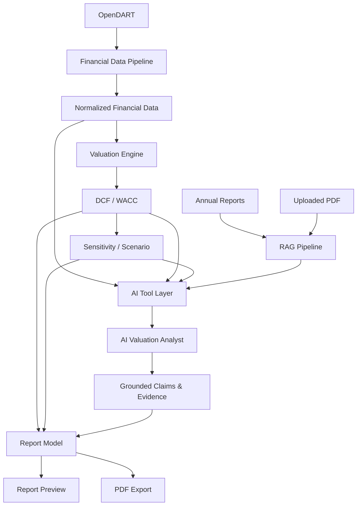

# ValuFlow

> **From Financial Statements to AI-powered Valuation.**
> OpenDART 재무데이터부터 DCF/WACC, AI 기반 분석, RAG, 검증, 보고서까지 연결한 기업가치평가 업무 자동화 플랫폼

🔗 **Live Demo** — https://valu-flow.vercel.app *(로그인·키 없이 체험 가능. 서버가 유휴 상태면 첫 요청은 수십 초 걸릴 수 있습니다)*

🏷️ **Release** — `v1.0.0` · Production Portfolio Release

> 데모의 학습용 가정 · 샘플 값은 **실제 투자 · 가치평가 의견이 아닙니다.**

---

## Overview

ValuFlow는 기업가치평가 과정에서 반복적으로 발생하는

- 재무데이터 수집 · 재무분석
- DCF / WACC 계산 · 민감도 및 시나리오 분석
- 공시 · 문서 근거 탐색
- AI 기반 분석
- 보고서 작성

을 하나의 workflow로 연결한 프로젝트입니다. 단순히 LLM에게 기업가치를 계산하게 하는 대신,

> **계산 · 데이터 · 판단의 책임을 분리한다**

는 원칙으로 설계했습니다.

| 역할 | 담당 |
|---|---|
| 계산 | **Deterministic Engine** |
| 데이터와 근거 | **OpenDART / RAG** |
| 해석과 workflow orchestration | **AI Analyst** |
| 가정과 최종 판단 | **Analyst (사람)** |

---

## Problem

기업가치평가는 단순한 계산 작업이 아닙니다. 실제 workflow는 여러 도구에 흩어져 반복됩니다.

```text
Financial Statements → Financial Analysis → Forecast Assumptions → DCF / WACC
        → Sensitivity / Scenario → Supporting Evidence → Review → Report
```

각 단계가 Excel, 공시 사이트, PDF, 검색, 문서 도구에 분산되면 **데이터 재입력 · 단위 변환 오류 · 계산 재현성 저하 · 근거 추적 어려움 · 보고서 작성 반복** 문제가 생깁니다. ValuFlow는 이 흐름을 하나의 서비스 안에서 연결합니다.

## Solution

```text
OpenDART / User PDF / Supporting Data
              ↓
       Data & RAG Layer
              ↓
 Deterministic Valuation Engine
              ↓
     AI Valuation Analyst
              ↓
   Validation & Evidence
              ↓
     Report Automation
```

AI는 기업가치를 **직접 계산하지 않습니다.** DCF와 WACC는 deterministic engine이 계산하고, AI는 이미 계산된 결과와 검색된 근거를 읽고 해석합니다. LLM의 수치 계산 오류와 출처 없는 판단을 줄이고, 결과를 재현할 수 있게 하려는 설계입니다.

---

## Key Features

### 1. OpenDART Financial Data Pipeline
기업을 선택하면 OpenDART의 실제 재무제표를 가져와 내부 데이터 구조로 정규화합니다. **재무제표 기준(자동 · 연결 · 개별)을 선택**할 수 있고, 자동은 연결을 우선합니다(두 기준을 섞지 않습니다).

지원 데이터: Revenue · Operating Profit · Net Income · CFO · CAPEX · D&A · 재무상태표 주요 항목.
각 값은 `Value · Unit · Source · Basis · Period · Data Quality`와 함께 관리하고, 계정 매핑 근거(Mapping Trace)를 확인할 수 있습니다.

**D&A Note Fallback** — OpenDART 구조화 재무제표에 감가상각비가 독립 계정으로 없는 경우(예: 삼성전자), 사업보고서 주석에서 찾습니다.

```text
Structured Financial Statements
        ↓ D&A 없음
Cash Flow Adjustment Note
        ↓ 없음
Nature of Expense Note
        ↓ 없음
PPE / Intangible Note (기능별 배분)
        ↓
D&A  (+ sourceType · 접수번호 기록)
```

감가상각비와 무형자산상각비가 **둘 다** 확인될 때만 사용하고(한쪽만 있는 부분값은 합계로 쓰지 않음), 끝내 없으면 0이나 추정값으로 채우지 않고 `source unavailable`을 유지합니다.

### 2. Valuation Engine
DCF/WACC 계산은 LLM과 분리된 deterministic engine이 맡습니다. UI와 AI는 별도의 valuation formula를 갖지 않아 계산 로직의 Single Source of Truth를 유지합니다.

```text
NOPAT = EBIT × (1 − Tax)         FCFF = NOPAT + D&A − CAPEX − ΔNWC
Re    = Rf + β × MRP             WACC = E/(D+E)·Re + D/(D+E)·Rd·(1−T)
EV    = Σ PV(FCFF) + PV(Terminal Value)         Equity = EV − Net Debt
```

### 3. Sensitivity & Scenario
결과를 하나의 값으로만 보이지 않습니다. **Sensitivity**(WACC × Terminal Growth 5×5, Base Case 명시)와 **Scenario**(Bear / Base / Bull)를 서로 다른 분석으로 구분해 제공하고, 상대가치(PER · PBR · EV/EBITDA) 입력으로 DCF 결과를 교차 검토합니다.

### 4. AI Valuation Analyst
AI는 Tool을 통해 필요한 정보만 선택적으로 조회합니다 — Historical · Forecast · Valuation · Sensitivity · Scenario · Relative · Disclosure · Uploaded Documents. Tool은 기본적으로 **read-only**라서 AI가 Valuation 가정이나 결과를 바꾸지 않습니다. 질문은 단순 질문(Quick)과 여러 Tool을 순서대로 쓰는 **Agent Workflow(Deep Analysis)**로 처리합니다.

### 5. Grounded Analysis
분석의 각 주장(Claim)은 근거(Evidence)에 연결됩니다.

```text
Claim → Evidence → Tool → Field / Value / Unit / Source / Time
```

```text
FACT · Supported · High Confidence
영업이익률 2023A 2.54% → 2025A 13.07%        Source: OpenDART
```

숫자와 출처를 확인할 수 없는 주장은 지원되지 않는 주장으로 처리하거나 limitation으로 표시합니다.

### 6. Disclosure & PDF RAG
두 종류의 문서를 같은 Knowledge Layer에서 검색합니다.

```text
OpenDART 사업보고서 → document.xml(ZIP) → XML 파싱 → Section → Chunk → Embedding → pgvector
사용자 PDF          → 검증 → 페이지별 추출 → Chunk → Embedding → pgvector
```

답변의 Evidence에는 `Uploaded PDF · Filename · Page · Excerpt`(공시는 보고서명 · 접수번호 · Section)가 표시됩니다. 사용자는 **자기가 올린 PDF를 직접 삭제**할 수 있고(업로드할 때 받은 삭제 토큰 기반), 다른 기업에 귀속된 문서는 검색되지 않습니다.

### 7. Deterministic Retrieval Routing
AI가 잘못된 문서를 검색하는 문제를 줄이기 위해 문서 질문의 검색 대상을 규칙으로 통제합니다.

| 질문 | 검색 대상 |
|---|---|
| "이 문서 / 업로드한 PDF" | Uploaded Document Search |
| "사업보고서 / 공시" | Disclosure Search |
| 둘 다 명시 | Both |
| 명시 없음 | General routing |

기업이 선택돼 있다는 이유만으로 모든 질문을 공시로 보내지 않으며, 대상 문서가 없으면 다른 source로 우회하지 않고 명확한 limitation을 보여 줍니다.

### 8. Report Automation
검증된 Valuation 결과로 보고서를 생성합니다. Report layer는 DCF/WACC를 **다시 계산하지 않고**, Preview와 PDF는 같은 Render Model을 씁니다.

`Cover · Executive Summary · Company Overview · Historical Financial Performance · Forecast Assumptions · WACC · DCF Valuation · Sensitivity · Scenario · Relative Valuation · Market & Peer Reference · Key Risks · Conclusion · Sources · Appendix` (근거가 없는 선택 섹션은 자동 제외)

```text
Verified Valuation Result → Report Snapshot → Report Model → Preview / PDF (A4, 한글)
```

---

## Screenshots

<!-- 이미지를 docs/images/ 에 넣은 뒤 아래 주석을 풀어 주세요 (파일이 없을 때 깨진 이미지가 보이지 않도록 주석 처리) -->

| 화면 | 설명 |
|---|---|
| Historical | OpenDART 실제 재무제표 기반 Historical (최근 연도가 왼쪽) |
| Valuation | Actual과 Forecast Assumption을 분리해 deterministic engine으로 DCF/WACC 계산 |
| Sensitivity | WACC × Terminal Growth 변화에 따른 가치 변화 |
| AI Analyst | FACT와 JUDGMENT를 구분하고 Evidence를 함께 표시 |
| Disclosure / PDF RAG | 파일명 · 페이지 · section · excerpt 등 검색 근거 |
| Report | Report Preview와 PDF |

<!--


-->

---

## Architecture



**AI 처리 흐름**

```text
User Question → Question Classification → Retrieval / Tool Routing → Deterministic Tools
   → Observation → Grounded Analysis → Claim–Evidence Validation → Final Answer
```

**RAG**

```text
Disclosure / PDF → Loader → Normalization → Chunking → Embedding → PostgreSQL + pgvector → Hybrid Retrieval → AI Analyst
```

Production은 Hybrid Search(Vector + Keyword)가 기본입니다. Local Reranker도 평가했지만 검색 품질 대비 latency · resource 비용을 고려해 production 기본 구성에서는 제외했습니다.

---

## Evaluation

AI 기능은 고정 평가셋과 Guardrail 테스트로 검증했습니다: Unsupported numeric claim · Hallucinated source · 단위 오류 · WACC 의미 오류 · 이전 기업 context 누수 · Prompt injection · System prompt 유출 · Tool routing · 문서 격리.

| (OpenDART RAG) | nDCG@5 |
|---|---|
| Vector only | ≈ 0.38 |
| **Hybrid** | **≈ 0.82** |
| Hybrid + Reranker | ≈ 0.79 |

평가셋 40문항 · 실행 84회에서 필수 Tool 호출 100%, 근거 없는 숫자 claim · 출처 위조 · 단위 오류 · WACC 의미 오류 · injection 성공 0건, Guardrail 17/17을 확인했습니다. 복잡한 모델을 무조건 추가하기보다 **평가 결과를 기준으로 Hybrid Search를 선택**했습니다.

> 질의 수가 적고 라벨이 충분히 검수되지 않은 소규모 평가입니다. 일반 성능으로 해석하지 마세요. 자세히: [`docs/STEP08_summary.md`](docs/STEP08_summary.md)

---

## Production

```text
Browser → Vercel (React / Vite) → FastAPI (Docker container) → PostgreSQL + pgvector
```

Hardening: CORS 제한 · 요청 검증 · 오류 정제(내부 정보 비노출) · 구조화 로그(본문/키 없음) · Health endpoint · Secret 분리(프론트 번들에 키 없음) · PDF 검증 · Tool 호출 예산 · 공개 API Rate Limit · 개발용 provider 차단.

### Public Portfolio Mode
별도의 Access Key 없이 체험할 수 있습니다.

- **Public**: 기업 검색 · OpenDART Historical · Valuation · Sensitivity / Scenario · AI Analyst · Disclosure / PDF RAG · Report Preview · PDF Export · 내 PDF 삭제
- **비용이 드는 기능은 IP 기반 Rate Limit**: AI 10 / hour · PDF Upload 2 / hour · Report PDF 4 / hour
- **Admin API(키 필요)**: 공시 수집 · 문서 재인덱싱 · 분석/Report 저장 조회 등 운영 기능

endpoint별 정책표: [`docs/PUBLIC_PORTFOLIO_MODE.md`](docs/PUBLIC_PORTFOLIO_MODE.md)

---

## Supported Companies

현재 Generic Valuation Model은 **제조업 / 일반 비금융 기업**(연결 재무제표, 매출원가 · 판관비 기능별 손익계산서)을 지원합니다.

| 상태 | 기업(실제 OpenDART로 확인) |
|---|---|
| ✅ 지원 | 삼성전자 · SK하이닉스 · 현대자동차 · LG화학 · POSCO홀딩스 |
| ⛔ Unsupported (구조) | NAVER — 비용을 성격별로 분류한 손익계산서 |
| ⛔ Unsupported (업종) | KB금융 — 금융업 · 카카오 — 은행 자회사를 포함한 연결 구조 |

지원하지 않는 구조는 값을 억지로 일반기업 구조에 맞추지 않고 이유와 함께 `Unsupported`로 표시합니다. 현대자동차처럼 금융 부문을 포함한 기업은 경고가 붙으며, CFO가 금융 부문 영향으로 음수일 수 있습니다.

---

## Data Integrity Principles

1. **Missing ≠ Zero** — 데이터를 찾지 못하면 0으로 대체하지 않습니다.
2. **Actual ≠ Estimate** — 실제 재무데이터와 Forecast Assumption을 구분합니다.
3. **Calculation ≠ AI Generation** — Valuation 계산은 LLM이 하지 않습니다.
4. **Source ≠ Model Memory** — 근거가 필요한 정보는 Tool / RAG source를 씁니다.
5. **Unsupported ≠ Forced Mapping** — 지원하지 않는 재무제표 구조를 억지로 변환하지 않습니다.
6. **No Company, No Data** — 기업을 선택하기 전에는 어떤 재무 · 가치평가 데이터도 보이지 않고, 기업을 바꾸면 이전 기업의 상태가 남지 않습니다.

---

## Tech Stack

| 영역 | 기술 |
|---|---|
| Frontend | React · TypeScript · Vite |
| Backend | Python · FastAPI |
| Data | OpenDART · PostgreSQL · pgvector · SQLAlchemy · Alembic |
| AI | OpenAI API · Tool Calling · Agent Workflow · RAG · Hybrid Search · Embedding · Grounding / Guardrails |
| Infra | Vercel · Docker · Container Backend · Managed PostgreSQL |
| Report | HTML · SVG · ReportLab (PDF) |

---

## Project Structure

```text
ValuFlow
├─ src/                      Frontend
│  ├─ valuation/             DCF / WACC deterministic engine
│  ├─ data/                  OpenDART 경계 · 정규화 · Repository
│  ├─ ai/                    AI Analyst · Tool · Agent · Retrieval Routing · Grounding · Eval
│  ├─ report/                Report model · sections · rendering · QA
│  ├─ pages/ components/ store/ engine/ styles/ content/
│  └─ ...
├─ backend/
│  ├─ app/
│  │  ├─ dart/               OpenDART 연동 · 사업보고서 파싱 · D&A 주석 fallback
│  │  ├─ normalization/      Raw 계정 → 정규화 + DataQuality
│  │  ├─ rag/ knowledge/     공시 · PDF chunking · embedding · 검색 · 업로드/삭제
│  │  ├─ ai/                 LLM Gateway · Tool catalog · backend 검색 Tool
│  │  ├─ report/             PDF 렌더링
│  │  └─ security.py         endpoint 정책 · rate limit · CORS
│  ├─ alembic/               DB 마이그레이션
│  └─ Dockerfile
├─ docs/                     설계 · 단계별 보고 · 운영 문서
└─ README.md
```

전체 구조와 모듈 설명은 [`docs/DEVELOPMENT.md`](docs/DEVELOPMENT.md)에 있습니다.

---

## Getting Started

```bash
# Frontend  (http://localhost:5173, /api 는 backend 로 proxy)
npm install && npm run dev

# Backend  (http://127.0.0.1:8000)
cd backend
uv venv .venv && uv pip install -p .venv/bin/python -r requirements-dev.txt
cp .env.example .env     # DART_API_KEY 등 입력 (git 에 올라가지 않음)
.venv/bin/uvicorn app.main:get_app --factory --port 8000

# Tests
npm test                 # frontend (708)
cd backend && .venv/bin/python -m pytest --ignore=tests/smoke   # backend
```

DB · AI · RAG 설정과 운영 절차는 [`docs/DEVELOPMENT.md`](docs/DEVELOPMENT.md), 배포는 [`docs/STEP10_production.md`](docs/STEP10_production.md)를 보세요.

---

## Limitations

- **Forecast Assumption**: Revenue Growth · Margin · CAPEX · ΔNWC 등은 사용자가 직접 입력하거나 학습용 가정을 명시적으로 적용합니다. AI가 임의로 정하지 않습니다.
- **Disclosure RAG 범위**: 공시 검색은 **운영자가 미리 수집한 기업**의 사업보고서만 대상입니다(수집은 관리자 전용, 질문이 수집을 일으키지 않음). 수집되지 않은 기업은 "현재 수집된 공시에서 확인할 수 없습니다"로 답합니다.
- **Market / Peer Provider**: 개발용 provider(Yahoo · FRED · Google News)는 production에서 차단합니다. 승인된 provider가 없으면 Market / Peer 데이터는 unavailable로 표시합니다.
- **Industry Coverage**: 제조업 및 일반 비금융 기업 중심입니다. 금융업과 비용 성격별 손익계산서 기업은 별도 모델이 필요합니다.
- **D&A**: 주석에서 읽은 값은 회사의 공시 방식에 따라 사용권자산 상각 포함 여부가 다를 수 있습니다.
- **Public Demo**: Rate Limit은 서버 프로세스 메모리 기준이라 다중 인스턴스 환경용 분산 limiter가 아닙니다. 사용자 계정이 없어, PDF 삭제 권한은 업로드한 브라우저의 토큰에 묶입니다(저장소를 지우면 권한을 잃음).

---

## Roadmap

### v1.1 — Assumption Intelligence
Forecast Assumption 도출 과정을 보조합니다.

```text
Historical Actual → Historical / Disclosure / Market Evidence → Assumption Recommendation
   → Suggested Value + Range + Basis → Analyst Review → Apply → Valuation Engine
```

우선 대상: Revenue Growth · Operating Margin · CAPEX · ΔNWC · Risk-free Rate.
목표는 AI가 가정을 대신 결정하는 것이 아니라 **근거 있는 가정 후보를 제시하고 Analyst가 최종 판단하게 돕는 것**입니다.

---

## What I Learned

ValuFlow를 만들며 가장 중요하게 생각한 것은 AI 기능을 많이 넣는 것이 아니라 **어떤 판단을 AI에게 맡기고, 어떤 판단을 시스템 또는 사람에게 남길 것인가**였습니다.

개발 중 직접 발견하고 구조적으로 고친 문제들:

- OpenDART 구조화 재무제표에 D&A가 존재하지 않는 문제 → 사업보고서 주석 fallback
- 주석 제목이 한 섹션으로 덮어써져 근거 인용이 틀어지던 문서 파싱 문제
- PDF 질문이 공시 검색으로 잘못 routing되던 문제 → 결정적 Retrieval Routing
- LLM의 금액 단위 변환 오류 → 표시값을 Tool이 제공
- 개발용 외부 데이터 source의 production 신뢰성 문제 → production 차단
- 거부 응답에 CORS 헤더가 없어 사용자에게 "연결 불가"로 보이던 문제

각 문제를 prompt 수정으로 덮지 않고, 데이터 → 계산 → Tool → AI → Evidence 흐름에서 **문제의 위치를 찾아 구조적으로** 해결했습니다.

---

## Release

### v1.0.0 — Production Portfolio Release

OpenDART Financial Pipeline · DCF / WACC Valuation Engine · Sensitivity / Scenario · AI Valuation Analyst · Disclosure / PDF RAG · Grounded Analysis · Report Automation · Public Production Deployment

---

**ValuFlow** — *From Financial Statements to AI-powered Valuation.*
