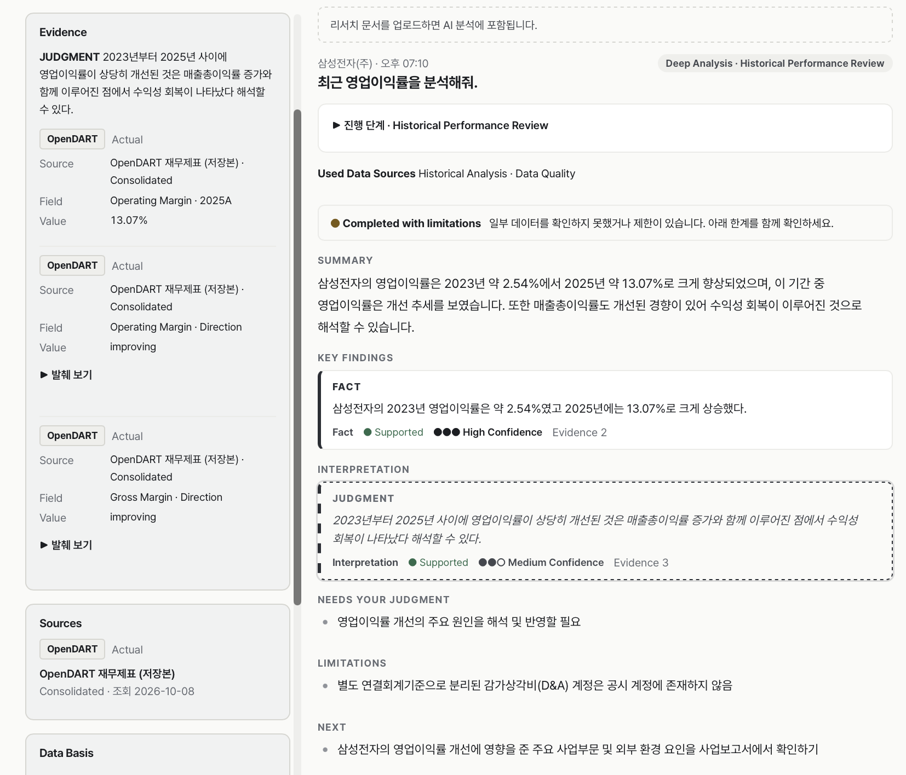
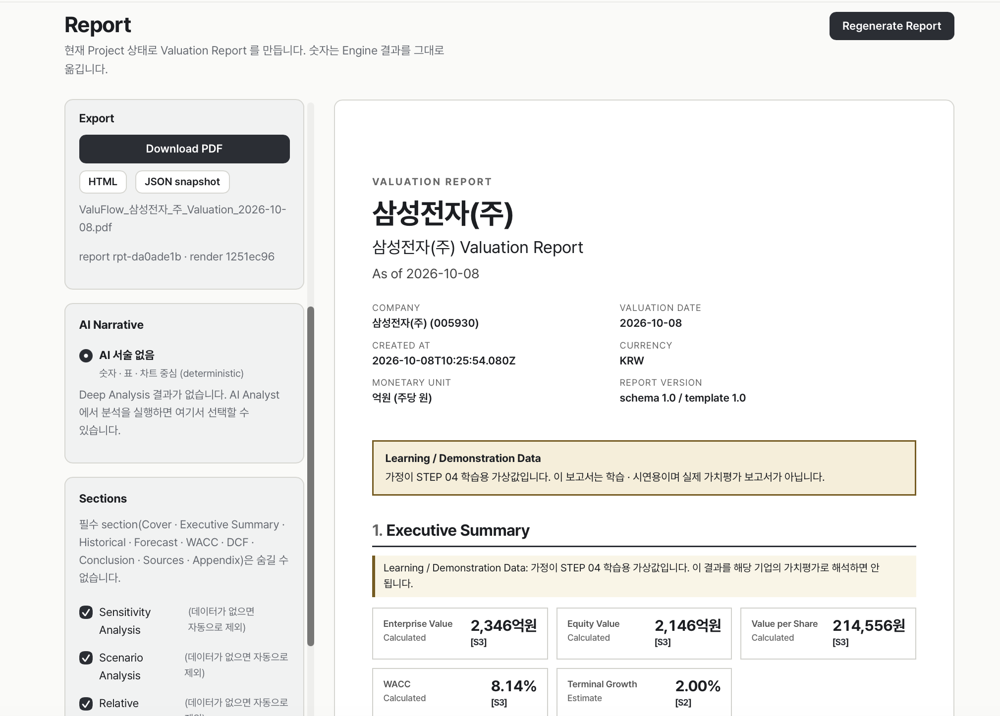
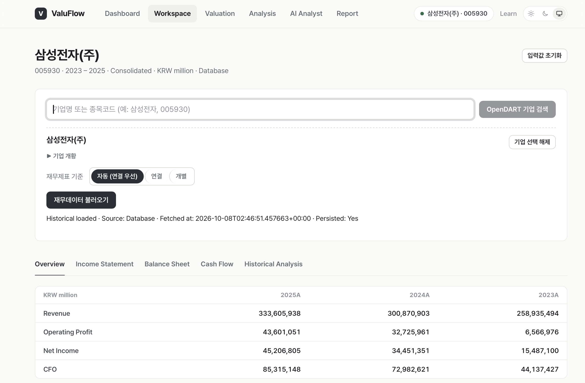
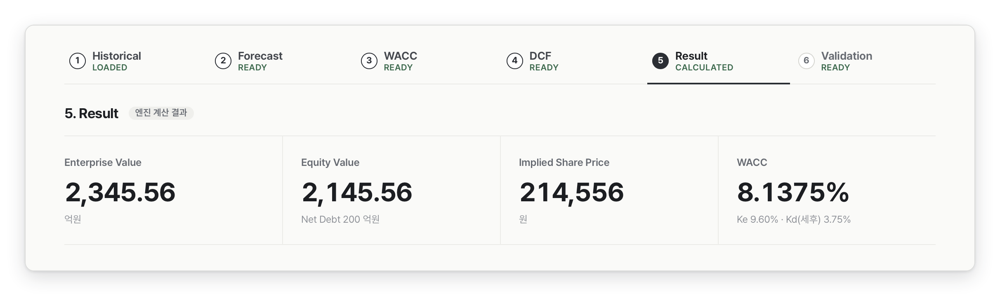
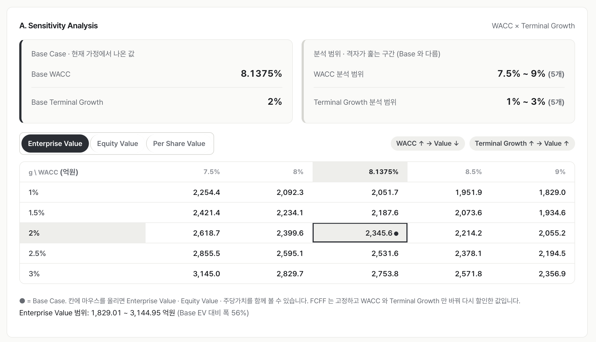
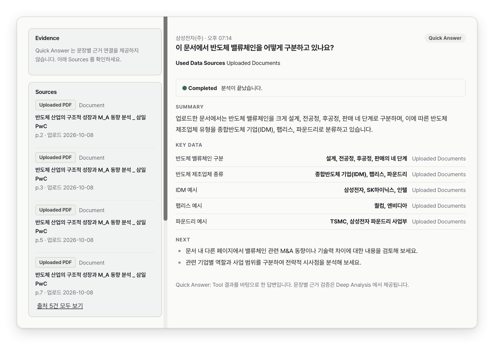
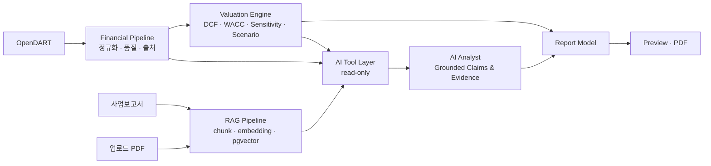

# ValuFlow

**From Financial Statements to AI-powered Valuation.**
OpenDART 재무제표 → DCF/WACC → 민감도·시나리오 → 근거 있는 AI 분석(RAG) → 보고서까지 한 흐름으로 잇는 기업가치평가 업무 자동화 서비스

🔗 **Live Demo** — https://valu-flow.vercel.app *(로그인·키 없이 체험 · 서버가 쉬고 있으면 첫 요청이 수십 초 걸릴 수 있어요)*
`React` `TypeScript` `FastAPI` `PostgreSQL + pgvector` `OpenAI` `Vercel` `Docker` · **v1.0.0**

> 데모에 쓰이는 가정·샘플 값은 학습용이며 **실제 투자·가치평가 의견이 아닙니다.**

<table>
<tr>
<td width="50%"><br><sub><b>AI Analyst</b> — FACT/JUDGMENT를 구분하고 Supported·Confidence·Evidence(OpenDART)를 함께 표시</sub></td>
<td width="50%"><br><sub><b>Report</b> — 검증된 결과로 Preview·PDF를 생성, 모든 숫자에 출처 표시([S#])</sub></td>
</tr>
</table>

---

## 왜 만들었나

기업가치평가는 재무제표 수집 → 분석 → DCF/WACC → 근거 조사 → 보고서가 Excel·공시 사이트·PDF·문서 도구에 흩어져 반복됩니다. 그러면 **데이터 재입력, 단위 오류, 재현 불가, 근거 추적 불가**가 생깁니다. ValuFlow는 이 흐름을 한 서비스로 잇되, 아래 원칙으로 설계했습니다.

> **계산은 엔진이, 근거는 데이터가, 해석은 AI가, 판단은 사람이.**

| 원칙 | 의미 |
|---|---|
| Calculation ≠ AI Generation | DCF/WACC는 deterministic engine만 계산. AI는 결과를 읽고 해석 (Tool은 read-only) |
| Missing ≠ Zero | 값을 못 찾으면 0·추정으로 채우지 않고 `source unavailable` 유지 |
| Actual ≠ Estimate | 실제 재무와 Forecast 가정을 분리 |
| Source ≠ Model Memory | 근거가 필요한 건 Tool/RAG 출처로만 말한다 |
| Unsupported ≠ Forced Mapping | 지원하지 않는 재무제표 구조는 억지 변환 없이 `Unsupported` |

---

## 화면

<table>
<tr>
<td width="50%"><br><sub><b>① Workspace</b> — 기업 선택 후 OpenDART 실제 재무제표 로드. 연결/개별 선택, 최근 연도가 왼쪽(DART와 동일)</sub></td>
<td width="50%"><br><sub><b>② Valuation</b> — 6단계 워크플로, deterministic engine의 EV·Equity·주당가치·WACC <i>(화면은 학습용 가정 기준)</i></sub></td>
</tr>
<tr>
<td width="50%"><br><sub><b>③ Sensitivity</b> — WACC × Terminal Growth 5×5, Base Case 표시, EV/Equity/주당가치 전환</sub></td>
<td width="50%"><br><sub><b>④ PDF RAG</b> — "이 문서에서…" 질문을 업로드 PDF로 라우팅, 문서명·페이지 출처 표시</sub></td>
</tr>
</table>

---

## 핵심 기능

**① OpenDART 재무 파이프라인** — 실제 재무제표를 내부 구조로 정규화하고 값마다 `단위·출처·기준·기간·데이터 품질·계정 매핑 근거`를 관리합니다. 재무제표 기준은 **자동(연결 우선)·연결·개별**을 고를 수 있습니다.

**② Valuation Engine** — `FCFF = NOPAT + D&A − CAPEX − ΔNWC`, `WACC = E/(D+E)·Re + D/(D+E)·Rd·(1−T)`, `EV = ΣPV(FCFF) + PV(TV)`, `Equity = EV − Net Debt`. UI·AI·Report 어디에도 별도 수식이 없어 계산의 Single Source of Truth를 지킵니다.

**③ 검증** — Sensitivity(WACC × g), Scenario(Bear/Base/Bull), 상대가치(PER·PBR·EV/EBITDA)로 하나의 숫자가 아닌 *범위*를 봅니다.

**④ AI Valuation Analyst** — Tool(Historical·Forecast·Valuation·Sensitivity·Scenario·Disclosure·Uploaded Docs)로 필요한 정보만 조회하고, 질문에 따라 Quick 답변 또는 **Agent Workflow(Deep Analysis)**로 처리합니다. 모든 Claim은 `Claim → Evidence → Tool → Field/Value/Unit/Source/Time`으로 연결되고, 근거 없는 숫자는 *Unsupported*로 걸러냅니다.

**⑤ 공시·PDF RAG** — 사업보고서(`document.xml` ZIP → 섹션 → chunk → pgvector)와 사용자 PDF를 같은 Knowledge Layer에서 Hybrid 검색합니다. **질문 표현으로 검색 대상을 결정적으로 라우팅**하고("이 문서"→업로드 PDF, "사업보고서"→공시), 다른 기업의 문서는 검색하지 않으며, 대상이 없으면 다른 source로 우회하지 않고 limitation을 알립니다.

**⑥ Report 자동화** — 검증된 결과를 Report Model로 고정해 Preview·PDF(A4, 한글)·HTML·JSON으로 출력합니다. Report는 DCF/WACC를 *다시 계산하지 않고*, Preview와 PDF는 같은 Render Model을 씁니다.

---

## 아키텍처



```text
Browser ── Vercel (React/Vite, 정적, secret 없음) ──▶ FastAPI (Docker) ──▶ PostgreSQL + pgvector
                                                          ├─ OpenDART · OpenAI (키는 서버에만)
                                                          └─ Rate limit · CORS · 오류 정제 · 구조화 로그
```

---

## 직접 부딪히고 구조적으로 푼 문제들

| 문제 | 원인 | 해결 |
|---|---|---|
| 삼성전자 **D&A가 계속 missing** | 매핑 실패가 아니라 DART 구조화 재무제표에 **원본 계정이 없음** | 사업보고서 주석 3단계 fallback(현금흐름 조정내역 → 비용의 성격별 분류 → 자산 주석) + 출처 기록. 끝내 없으면 `source unavailable` (0·추정 금지) |
| 주석 근거 인용이 엉뚱한 제목으로 표시 | 파서가 주석 제목을 상위 섹션 제목에 덮어씀 | 주석을 하위 섹션으로 분리 (섹션 46 → 118, 텍스트 손실 0) |
| "이 문서에서…" 질문이 **공시 검색**으로 감 | 질문 분류가 LLM에 전달되지 않고, 프롬프트가 공시를 우선 안내 | 결정적 Retrieval Routing + 허용된 검색 Tool만 모델에 노출 |
| LLM의 금액 **단위 착오**(100~1000배) | 모델이 단위 환산을 직접 수행 | 표시값을 Tool이 제공, 모델은 인용만 |
| 사용 한도·삭제 거부가 "서버 연결 불가"로 표시 | 거부 응답(401/429)에 CORS 헤더 없음(미들웨어 순서) | CORS를 가장 바깥에 배치 |
| Reranker를 쓸지 | 평가: nDCG@5 0.82 → 0.79, 지연 225ms → 1,996ms | **평가 결과로 Hybrid 선택**, Reranker는 production 제외 |
| 개발용 시장 데이터(Yahoo 등)의 신뢰성 | 비공식 source | production에서 차단하고 `unavailable`로 표시 |

---

## 평가

고정 평가셋(40문항·84회 실행)과 Guardrail 테스트로 검증했습니다: 근거 없는 숫자 claim · 출처 위조 · 단위 오류 · WACC 의미 오류 · 이전 기업 context 누수 · Prompt injection · System prompt 유출 · Tool routing · 문서 격리. 필수 Tool 호출 100%, 위 항목의 위반 0건, Guardrail 17/17.

| OpenDART RAG | nDCG@5 |
|---|---|
| Vector only | ≈ 0.38 |
| **Hybrid (채택)** | **≈ 0.82** |
| Hybrid + Reranker | ≈ 0.79 |

> 질의 수가 적고 라벨이 충분히 검수되지 않은 소규모 평가입니다. 일반 성능으로 해석하지 마세요. ([상세](docs/STEP08_summary.md))

---

## Production & 공개 데모

별도 키 없이 체험할 수 있고, 비용이 드는 기능은 **IP 기반 Rate Limit**(AI 10 / PDF 업로드 2 / Report PDF 4 per hour)과 payload·PDF 검증으로 보호합니다. 저장·재인덱싱·공시 수집은 **Admin API**로 분리했고, 사용자는 **자기가 올린 PDF를 삭제 토큰으로 직접 삭제**할 수 있습니다(서버에는 토큰 해시만 저장). CORS 제한 · 오류 정제 · Health endpoint · 구조화 로그 · Secret 분리 · Tool 호출 예산도 적용했습니다. ([정책표](docs/PUBLIC_PORTFOLIO_MODE.md))

## 지원 기업

제조업 / 일반 비금융 기업(연결, 매출원가·판관비 기능별 손익계산서)을 지원합니다.

| 상태 | 기업 (실제 OpenDART로 확인) |
|---|---|
| ✅ 지원 | 삼성전자 · SK하이닉스 · 현대자동차 · LG화학 · POSCO홀딩스 |
| ⛔ Unsupported | NAVER(비용 성격별 손익계산서) · KB금융(금융업) · 카카오(은행 자회사 포함 연결) |

---

## 시작하기

```bash
npm install && npm run dev                      # Frontend  http://localhost:5173
cd backend && uv venv .venv && uv pip install -p .venv/bin/python -r requirements-dev.txt
cp .env.example .env                            # DART_API_KEY 등 입력 (git 제외)
.venv/bin/uvicorn app.main:get_app --factory --port 8000
npm test && cd backend && .venv/bin/python -m pytest --ignore=tests/smoke    # 테스트
```

DB·AI·RAG 설정과 전체 구조는 [`docs/DEVELOPMENT.md`](docs/DEVELOPMENT.md), 배포·운영은 [`docs/STEP10_production.md`](docs/STEP10_production.md)를 보세요.

## 한계와 다음 단계

- **Forecast 가정**은 사용자가 입력하거나 학습용 가정을 명시적으로 적용합니다. AI가 정하지 않습니다.
- **공시 RAG**는 운영자가 미리 수집한 기업만 대상입니다(수집은 관리자 전용). 수집되지 않은 기업은 "수집된 공시에서 확인할 수 없음"으로 답합니다.
- 금융업·비용 성격별 손익계산서 기업은 별도 모델이 필요합니다. Rate Limit은 단일 인스턴스(메모리) 기준입니다.
- **v1.1 — Assumption Intelligence**: Historical·공시·시장 근거로 Revenue Growth·Margin·CAPEX·ΔNWC·Rf의 *가정 후보와 범위, 근거*를 제시하고, Analyst가 검토·적용합니다. AI가 가정을 대신 정하지 않습니다.

---

*ValuFlow는 AI 기능을 많이 넣기보다 **어떤 판단을 AI에게 맡기고 어떤 판단을 시스템·사람에게 남길 것인가**에 집중한 프로젝트입니다.*
